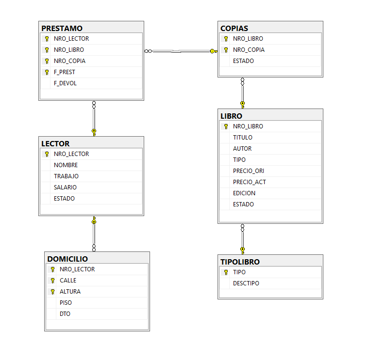

# 📚 Trabajo Práctico Final - Base de Datos II
> Sistema de Gestión de Préstamos para Biblioteca

Este repositorio contiene el desarrollo del Trabajo Práctico Final para la materia **Base de Datos II**. El proyecto consiste en el diseño, implementación y normalización de una base de datos relacional para gestionar el inventario, lectores y préstamos de una biblioteca, utilizando **Microsoft SQL Server**.

## 📋 Descripción del Proyecto

El objetivo principal fue refactorizar un esquema de base de datos inicial para asegurar la integridad de los datos, aplicar normalización y desarrollar lógica de negocio mediante programación en T-SQL.

El sistema maneja:
* **Libros y Copias:** Control de inventario y estado (`Disponible`, `Prestado`, `No Disponible`).
* **Lectores:** Administración de usuarios con validación de estados (`Habilitado`, `Inhabilitado`).
* **Préstamos:** Registro transaccional de préstamos y devoluciones.

## 🛠️ Tecnologías Utilizadas

* **Motor de Base de Datos:** SQL Server 2019+
* **Lenguaje:** T-SQL
* **Herramienta:** SQL Server Management Studio (SSMS)

## 📂 Estructura del Repositorio

El proyecto se divide en 3 scripts SQL que deben ejecutarse en orden:

| Orden | Archivo | Descripción |
| :--- | :--- | :--- |
| **1** | `DDL_Libros_TP.sql` | **Definición de Datos:** Creación de tablas (`LIBRO`, `LECTOR`, `PRESTAMO`, etc.), definición de claves primarias (PK) y foráneas (FK), y restricciones de integridad (CHECK, DEFAULT). |
| **2** | `DML_Libros_TP.sql` | **Manipulación de Datos:** Carga inicial de datos (población de tablas) para pruebas. Incluye casos de prueba de inserción. |
| **3** | `TP_Parte2.sql` | **Lógica de Negocio y Testing:** Contiene la creación de objetos programables (Stored Procedures, Triggers, Vistas, Funciones) y el script final de pruebas unitarias. |

## 🚀 Funcionalidades Implementadas (En `TP_Parte2.sql`)

El archivo `TP_Parte2.sql` centraliza la lógica avanzada requerida:

### 1. Transacciones y Stored Procedures
* **`SP_REGISTRAR_PRESTAMO`**: Procedimiento almacenado que gestiona el alta de préstamos.
    * Utiliza `BEGIN TRAN`, `COMMIT` y `ROLLBACK` para asegurar la consistencia (ACID).
    * Implementa manejo de errores con `TRY/CATCH` y `THROW` para validar reglas de negocio (stock disponible, lector habilitado).

### 2. Automatización (Triggers)
* **`TRG_DEVOLUCION_LIBRO`**: Disparador que detecta la actualización de la fecha de devolución en la tabla `PRESTAMO` y cambia automáticamente el estado de la copia a `'D'` (Disponible) en la tabla `COPIAS`.

### 3. Auditoría (Vistas)
* **`V_INCONS_PRESTAMOS`**: Vista de monitoreo que detecta inconsistencias lógicas, como copias marcadas como disponibles que tienen préstamos activos, o viceversa.

### 4. Funciones
* **`FN_CANTIDAD_L_PENDIENTES`**: Función escalar que retorna la cantidad de libros que un lector tiene en su poder actualmente.

## ⚙️ Instrucciones de Ejecución

1. Clonar este repositorio.
2. Abrir **SQL Server Management Studio (SSMS)**.
3. Ejecutar los scripts en el orden numérico indicado (1 → 2 → 3).
4. **Validación:** Al final del script `TP_Parte2.sql` se encuentra una sección de **Testeo** comentada, que ejecuta las pruebas de:
    - Registro de préstamo exitoso.
    - Verificación de cambio de estado.
    - Prueba del Trigger de devolución.
    - Consulta de inconsistencias.

---
**Autor:** Lautaro Artecona
**Materia:** Base de Datos II - Instituto ORT
**Año:** 2025
